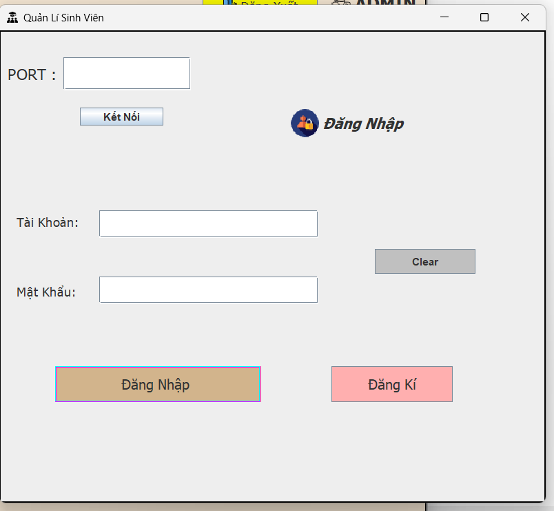

# TCP/IP Multithreaded Server Project

## Overview

This project demonstrates a TCP/IP server application using multithreading for concurrent client connections. The server interacts with clients over TCP/IP sockets, handling multiple clients simultaneously using threads. Additionally, it utilizes DBeaver as a database management tool to interact with the underlying database.

## Features

- **TCP/IP Server**: Implements a server that listens for incoming connections on a specified port using TCP/IP.
- **Multithreading**: Utilizes multithreading to handle multiple client connections concurrently, ensuring efficient resource utilization.
- **Database Integration**: Demonstrates integration with DBeaver for database operations, such as querying and updating data.
- **Documentation**: Includes comprehensive documentation to guide users on setting up and running the server, client interactions, and database management.

## Technologies Used

- **Programming Languages**: Java (for server implementation)
- **Tools and Libraries**:
  - DBeaver: Database management tool for SQL database interaction
  - Git: Version control system for managing project source code
  - IDE: Integrated Development Environment (e.g., IntelliJ IDEA, Eclipse) for Java development

## Setup and Usage

### Prerequisites

- Java Development Kit (JDK) installed
- DBeaver installed for database management
- Git installed for version control
## Image of the interface
### Client

### Server

